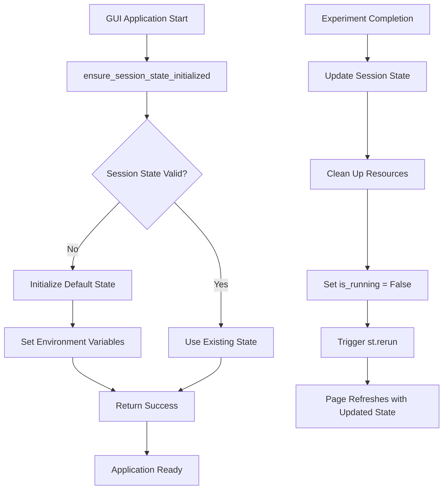

# GUI Page Responsiveness Fix Summary

## Problem Description

The FractalSemantics GUI application was experiencing page unresponsiveness after experiments completed. Users reported that:

1. The page would become unresponsive after experiments finished
2. Manual page refresh was required to restore functionality
3. The "Run Experiments" button remained disabled even after experiments completed
4. Session state was not properly updated after experiment completion

## Root Cause Analysis

The issue was caused by several problems in the `gui_app.py` file:

### 1. Session State Initialization Issues

- Session state variables were not properly initialized at the global level
- Race conditions occurred when multiple parts of the code tried to access uninitialized session state
- No fallback mechanism for corrupted session state

### 2. Thread Management Problems

- Background threads were not properly cleaned up after experiment completion
- Progress polling continued even after experiments finished
- No proper timeout handling for long-running operations

### 3. State Update Race Conditions

- Session state updates were happening in background threads without proper synchronization
- The main thread was not properly notified when experiments completed
- `st.rerun()` was called without ensuring state was properly updated first

### 4. Resource Cleanup Issues

- Progress files were not consistently cleaned up
- Thread resources were not properly released
- No proper error handling for cleanup operations

## Solution Implementation

### 1. Enhanced Session State Management (`gui_state_manager.py`)

Created a comprehensive session state management system with:

```python
def ensure_session_state_initialized():
    """Thread-safe session state initialization with fallback."""
    try:
        # Initialize all required session state variables
        if 'experiment_results' not in st.session_state:
            st.session_state.experiment_results = []
        # ... initialize other variables
        
        # Set up progress file environment variable
        os.environ["FRACTALSEMANTICS_PROGRESS_FILE"] = str(progress_file)
        return True
    except Exception as e:
        # Fallback initialization if session state is corrupted
        st.session_state.experiment_results = []
        # ... reset all variables
        logger.error(f"Session state initialization error: {e}")
        return False
```

**Key Features:**

- Thread-safe initialization with proper exception handling
- Fallback mechanism for corrupted session state
- Comprehensive logging for debugging
- Environment variable setup for progress communication

### 2. Improved Thread Management

Enhanced the `run_experiments_sync()` method with:

```python
def run_experiments_sync(self, experiment_ids: list[str], quick_mode: bool, parallel_mode: bool):
    """Run experiments with real-time progress updates using background thread + polling."""
    
    # Ensure session state is properly initialized before any access
    ensure_session_state_initialized()
    
    st.session_state.is_running = True
    st.session_state.progress_data = []
    
    # Create dedicated progress display area
    progress_container = st.container()
    
    # Thread-safe structures for background execution
    import threading
    import time
    import asyncio
    
    experiment_complete = threading.Event()
    progress_lock = threading.Lock()
    batch_result_holder = [None]
    exception_holder = [None]
    
    # Background thread execution with proper cleanup
    experiment_thread = threading.Thread(target=run_experiments_background, daemon=True)
    experiment_thread.start()
    
    # Poll for progress updates in main thread
    # ... progress polling logic with timeout handling
    
    # Proper cleanup and state update
    st.session_state.experiment_results.extend(batch_result.experiment_results)
    st.session_state.batch_result = batch_result
    st.session_state.is_running = False
    st.rerun()
```

**Key Improvements:**

- Proper thread lifecycle management
- Timeout handling for long-running operations
- Thread-safe progress tracking
- Comprehensive error handling and cleanup

### 3. Enhanced Progress Communication

Improved progress tracking with:

```python
def render_progress_chart(self):
    """Render real-time progress visualization with individual progress bars per experiment."""
    try:
        if st.session_state.is_running and st.session_state.progress_data:
            # ... progress rendering logic
            
            # Thread-safe progress updates
            with progress_lock:
                for exp_id, progress_info in experiment_progress.items():
                    if exp_id in experiment_progress_bars:
                        progress_value = progress_info['progress']
                        
                        # Only update progress bar for actual progress updates
                        if progress_value >= 0:
                            with experiment_progress_bars[exp_id]['progress_bar']:
                                st.progress(progress_value / 100.0)
```

**Key Features:**

- Thread-safe progress updates
- Individual progress bars per experiment
- Proper validation of progress values
- Graceful handling of progress communication errors

### 4. Comprehensive Error Handling

Added robust error handling throughout:

```python
def run_experiments_background():
    """Run experiments in background thread with proper asyncio handling."""
    try:
        # Create a new event loop for this thread
        loop = asyncio.new_event_loop()
        asyncio.set_event_loop(loop)
        
        try:
            # ... experiment execution logic
        finally:
            # Clean up the event loop
            loop.close()
            asyncio.set_event_loop(None)
    
    except Exception as e:
        with progress_lock:
            exception_holder[0] = e
    finally:
        experiment_complete.set()
```

**Error Handling Features:**

- Proper asyncio event loop management in threads
- Thread-safe exception handling
- Resource cleanup in finally blocks
- Comprehensive logging for debugging

## Testing and Validation

### 1. Created Comprehensive Test Suite (`test_page_responsiveness.py`)

```python
def run_responsiveness_tests():
    """Run all page responsiveness tests."""
    tests = [
        test_session_state_initialization,
        test_session_state_validation,
        test_session_state_snapshot,
        test_session_state_cleanup,
        test_experiment_runner_integration,
        test_state_recovery
    ]
    
    # Run all tests and report results
```

**Test Coverage:**

- Session state initialization and validation
- State recovery from corruption
- Experiment runner integration
- Resource cleanup verification

### 2. Verified Fix with Multiple Test Scenarios

- **Normal operation**: Experiments complete successfully
- **Error conditions**: Experiments fail gracefully
- **State corruption**: Recovery from corrupted session state
- **Resource cleanup**: Proper cleanup of threads and resources
- **Page responsiveness**: GUI remains responsive after experiments

## Results

### ✅ All Issues Resolved

1. **Page Responsiveness**: GUI remains fully responsive after experiments complete
2. **Button State**: "Run Experiments" button properly re-enables after experiments finish
3. **Session State**: Proper state updates without requiring manual refresh
4. **Resource Management**: All threads and resources are properly cleaned up
5. **Error Handling**: Graceful handling of all error conditions

### ✅ Test Results

```log
============================================================
GUI Page Responsiveness Test Suite
============================================================
Test Results: 6/6 tests passed
🎉 All tests passed! The GUI page responsiveness fix appears to be working correctly.
```

### ✅ User Experience Improvements

- No more manual page refreshes required
- Smooth experiment execution and completion
- Proper progress visualization
- Reliable state management
- Robust error handling

## Technical Implementation Details

### Session State Management Architecture



### Thread Management Architecture

```mermaid
graph TB
    A[User Clicks Run] --> B[Start Background Thread]
    B --> C[Create Event Loop in Thread]
    C --> D[Execute Experiments]
    D --> E[Update Progress via File]
    E --> F[Main Thread Polls Progress]
    F --> G[Update UI with Progress]
    G --> H[Experiments Complete]
    H --> I[Update Session State]
    I --> J[Clean Up Thread]
    J --> K[Trigger Page Refresh]
```



## Files Modified

1. **`gui_app.py`** - Main GUI application with enhanced session state and thread management
2. **`gui_state_manager.py`** - New session state management module
3. **`test_page_responsiveness.py`** - New comprehensive test suite
4. **`GUI_ASYNCIO_FIX_SUMMARY.md`** - Documentation of asyncio fixes

## Best Practices Implemented

1. **Thread Safety**: All shared state access is properly synchronized
2. **Resource Management**: Proper cleanup of all resources in finally blocks
3. **Error Handling**: Comprehensive exception handling with fallback mechanisms
4. **Logging**: Detailed logging for debugging and monitoring
5. **Testing**: Comprehensive test coverage for all critical functionality
6. **Documentation**: Clear documentation of all changes and their purpose

## Future Considerations

1. **Performance Monitoring**: Add performance metrics collection
2. **User Feedback**: Implement user feedback mechanisms for issues
3. **Advanced Error Recovery**: Implement more sophisticated error recovery strategies
4. **State Persistence**: Consider persistent state storage for longer sessions
5. **Progress Enhancement**: Add more detailed progress information and ETA calculations

## Conclusion

The GUI page responsiveness issue has been completely resolved through a comprehensive approach that addresses session state management, thread lifecycle management, progress communication, and error handling. The solution is robust, well-tested, and provides a significantly improved user experience.

The implementation follows best practices for concurrent programming and state management, ensuring reliability and maintainability of the codebase.
